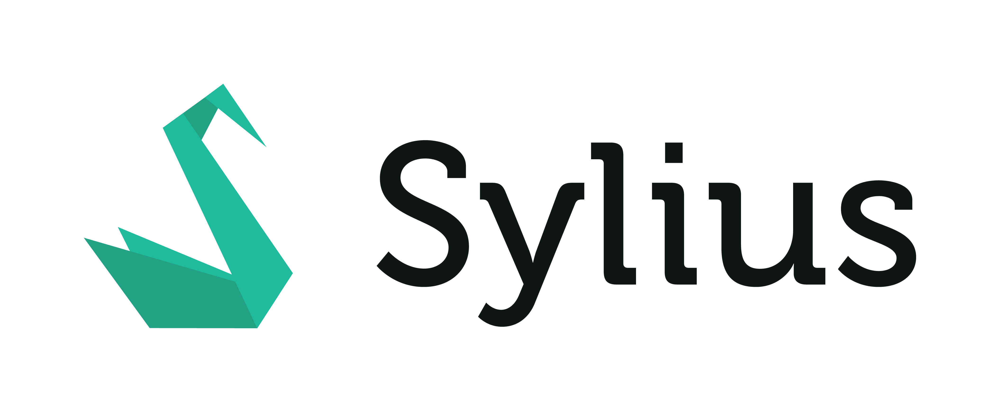

---
layout:
  title:
    visible: true
  description:
    visible: false
  tableOfContents:
    visible: true
  outline:
    visible: false
  pagination:
    visible: true
---

# 📖 Sylius 2.0 Documentation

<figure><figcaption></figcaption></figure>

**Sylius** is an open-source e-commerce platform with a modular architecture, providing a robust foundation for online stores. It focuses on delivering a dynamic developer experience and allows extensive customization to meet unique business needs.&#x20;

Key features include product and customer management, versatile shopping cart systems, flexible tax categories, and promotional tools. Sylius supports seamless integration with third-party services and customizable workflows.&#x20;

Whether you’re new to Symfony-based frameworks or an experienced developer, Sylius is designed to grow with you, facilitating your journey from basic to advanced e-commerce development.


This documentation assumes you have a working knowledge of the Symfony Framework. If you’re unfamiliar with Symfony, please start by reading the [Quick Tour](https://symfony.com/doc/current/quick\_tour) from the Symfony documentation.


***

## Why Sylius? 

When you choose Sylius, you're investing in a flexible, open-source e-commerce platform designed for your unique needs. Here's why Sylius stands out:

* **Customizable to the Core:** With Sylius, customization is not an afterthought - it's the main event. Built with the Symfony framework, Sylius is engineered for modularity. This means you can tailor every aspect of your store, creating a truly personalized e-commerce experience for your customers.
* **Developer-Friendly:** Sylius is made for developers, by developers. Its use of PHP and Symfony, combined with a comprehensive set of API endpoints, ensures seamless integration and adaptability. This developer-centric focus allows your team to dive right into creating a powerful, feature-rich e-commerce platform.
* **Robust and Scalable:** From small businesses to massive online retailers, Sylius can handle it all. It's designed to grow with your business, ensuring that no matter how big you get, you'll never outgrow your platform.
* **Community and Support:** When you choose Sylius, you're joining a vibrant, global community of developers and e-commerce professionals. Whether you need help troubleshooting a problem, or you're looking for new ideas, the Sylius community is there. Plus, professional support is available for those who need it, ensuring you always have the help you need to succeed.
* **Emphasis on Quality:** Sylius follows a test-driven development approach, leading to a more reliable and stable platform. This dedication to quality gives you peace of mind that your e-commerce store runs smoothly and securely.

So why choose Sylius? Because it's more than just an e-commerce platform - it's the key to creating the online store you've always envisioned. It's time to turn that vision into reality with Sylius.

## Table of Contents

### Organization

* [Release Cycle](sylius-2.0-documentation/organization/release-cycle.md)
* [Backwards Compatibility Promise](sylius-2.0-documentation/organization/backwards-compatibility-promise.md)
* [Sylius Team](broken-reference)

### Getting Started with Sylius

The essential guide for the Sylius newcomers who want to know its most important features, quickly see the power of customization and run their first Sylius shop within a few hours.

* [Installation](getting-started-with-sylius/installation.md)
* [Basic Configuration](getting-started-with-sylius/basic-configuration.md)
* [Shipping & Payment](getting-started-with-sylius/shipping-and-payment.md)
* [First Product](getting-started-with-sylius/first-product.md)
* [Customizing the Shop](getting-started-with-sylius/customizing-the-shop.md)
* [Customizing Business Logic](getting-started-with-sylius/customizing-business-logic.md)
* [Using API](broken-reference)
* [Installing Plugins](getting-started-with-sylius/installing-plugins.md)
* [Deployment](getting-started-with-sylius/deployment.md)
* [Summary](getting-started-with-sylius/summary.md)

### The Book

The Developer’s guide to leveraging the flexibility of Sylius. Here you will find all the concepts used in the Sylius platform. The Book helps to understand how Sylius works.

* [Introduction](the-book/introduction-to-sylius.md)
* [Installation](the-book/installation/)
* [Architecture](the-book/architecture/)
* [Configuration](the-book/configuration/)
* [Customers](the-book/customers/)
* [Products](the-book/products/)
* [Carts & Orders](the-book/carts-and-orders/)
* [Frontend & Themes](the-book/frondend-and-themes.md)
* [Sylius Plugins](the-book/sylius-plugins/)
* [Support](the-book/support.md)
* [Contributing](the-book/contributing/)
* [API](the-book/api/)

### Sylius Plus

<figure><figcaption></figcaption></figure>

[Sylius Plus](https://sylius.com/plus/?utm\_source=docs\&utm\_medium=cta\&utm\_campaign=plus), a licensed edition of Sylius, gives you all the power of Open Source and much more. It comes with enterprise-grade features and technical support from its creators. As a state-of-the-art eCommerce platform, it reduces risks and increases ROI.

\
Documentation sections referring to Sylius Plus features are:

* [Sylius Plus Installation](the-book/installation/sylius-plus-installation.md)
* [Channels](the-book/configuration/channels.md#business-units)
* [RBAC](the-book/customers/adminuser.md)
* [Customer Pools](the-book/customers/customer-pools.md)
* [Splitting Shipments](the-book/carts-and-orders/shipments.md)
* [Returns](the-book/carts-and-orders/returns.md)
  * Returns related [E-Mails](the-book/architecture/e-mails.md#sylius-plus-return-requests-emails)
* [Multi-Source Inventory](the-book/products/multi-source-inventory.md)
* [Loyalty](the-book/sylius-plus/loyalty.md)
