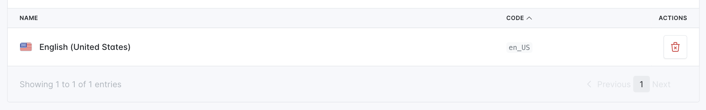
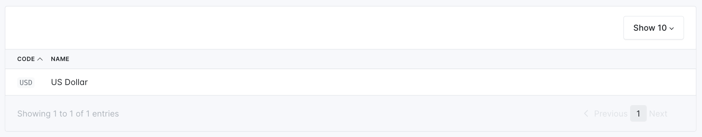
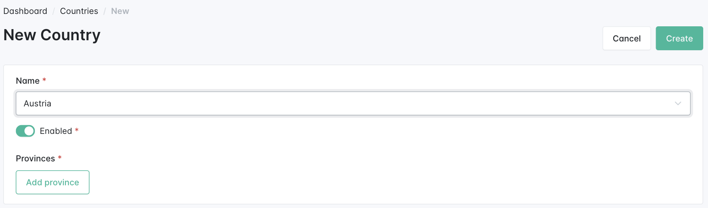
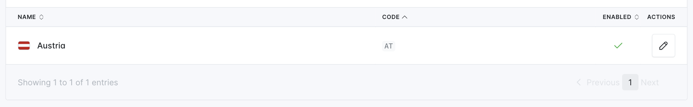
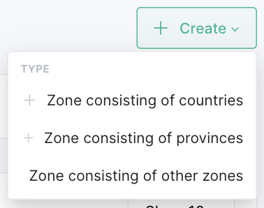
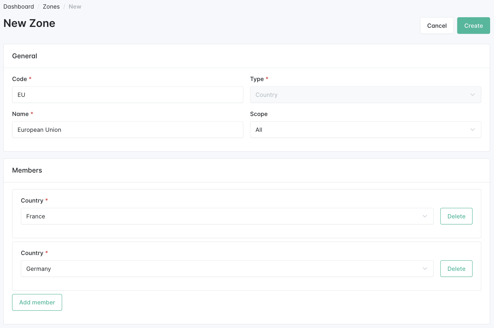

---
layout:
  title:
    visible: true
  description:
    visible: false
  tableOfContents:
    visible: true
  outline:
    visible: true
  pagination:
    visible: true
---

# Basic Configuration

The Configuration section is the first place you should check out in the Admin panel. There you can find a bunch of modules used to customize your shop the most basic data.

## Channels

The **Channels** section is one of the most important areas in Sylius. A channel defines core data about your store, including available locales, currencies, and billing details.

By default, you should already have one channel created during installation. You can edit your channel's configuration to suit your needs:

<figure><figcaption></figcaption></figure>

## Locales

Sylius supports internationalization, allowing you to add new locales for your shop easily. This enables customers to browse the site in their preferred language.

At this point, you likely only have **English (United States)** as your base locale, which was set during installation. All products, taxons, and other content must be created with at least an English name.

You can add new locales to expand language support for your customers:

<figure><figcaption></figcaption></figure>

## Currencies

Each channel in Sylius operates with one **Base Currency**, but you can display prices in multiple currencies. Conversion between currencies is managed by configuring **Exchange Rates**.

During installation, **USD** was set as the default currency. You can add more currencies as needed:

<figure><figcaption></figcaption></figure>


The initial data (channel, locale, currency) was created by the installation command. However, to fully configure your store, you should add the following items.


## Countries

Most eCommerce stores ship to multiple countries. In the **Countries** section, you can configure which countries are available for shipping.

To add a country:

1. Navigate to the **Countries** section.
2. Add the desired countries for your store’s shipping destinations.

<figure><figcaption></figcaption></figure>

Once added, countries will be displayed in the index:

<figure><figcaption></figcaption></figure>

## Zones

**Zones** are used for shipping and tax purposes, and they can consist of countries, provinces, or even other zones.

To finish your basic setup, create a zone named the **European Union** consisting of the European countries. This is essential for shipping and taxing configurations.

<figure><figcaption></figcaption></figure>

After creating this zone, your basic shop configuration will be complete:

<figure><figcaption></figcaption></figure>

## Learn more

* [Channels](../the-book/configuration/channels.md)
* [Currencies](../the-book/configuration/currencies.md)
* [Pricing](../the-book/products/pricing.md)
* [Locales](../the-book/configuration/locales.md)
