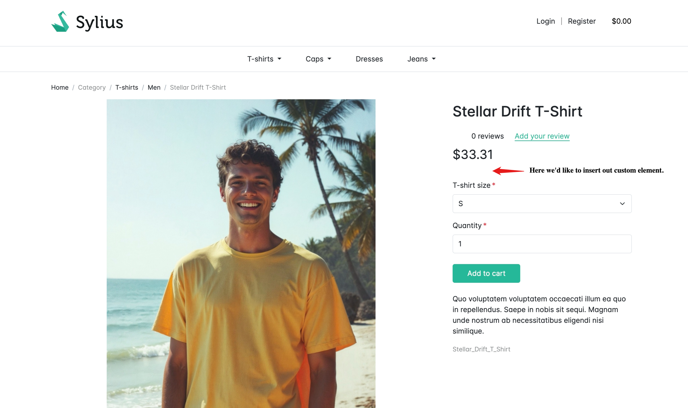

---
layout:
  title:
    visible: true
  description:
    visible: false
  tableOfContents:
    visible: true
  outline:
    visible: true
  pagination:
    visible: true
---

# Customizing the Shop

Sylius stands out from other eCommerce platforms not only because of its vibrant community and clean codebase but also due to its exceptional developer experience. Its flexibility and ease of customization allow you to adapt the platform to meet your unique business needs.

Let’s explore how you can leverage these features to make a simple yet important customization: replacing the default Sylius logo with your store’s custom logo.

## Logo

The default Sylius templates are clean and elegant, but you might want to make your store unique by customizing it with your brand’s logo. Here’s how you can replace the default Sylius logo:

<figure><figcaption></figcaption></figure>

### Step 1: Add Your Custom Logo

1.  Copy your logo file to the following directory:

    ```bash
    assets/shop/images/logo.png
    ```
2.  Next, you need to import the logo in the `entry.js` file located at:

    ```bash
    assets/shop/entry.js
    ```
3.  Add the following line to import the logo:

    <pre class="language-js"><code class="lang-js"><strong>import './images/logo.png';
    </strong></code></pre>
4.  After making this change, run the following command to rebuild the assets:

    ```bash
    yarn build
    ```

### Step 2: Embed the Logo in the Template

Now, let’s create the template that is responsible for displaying the logo. All templates are supposed to be managed and organized in the `/templates` directory. Your new template might look like this:

```twig

```

Ensure the second argument in the `asset()` function is correct for the app context. For more details, check the [Managing Assets](../the-book/frondend-and-themes.md) page.

### Step 3: Override the Template with Sylius Twig Hooks


Sylius Twig Hooks is a completely new concept introduced in Sylius 2.0. You can find dedicated documentation on this topic [here](https://sylius-1.gitbook.io/stack/dWolXcvu3MnA2piZOEle/twig-hooks/getting-started).


Sylius 2.0 introduces **Twig Hooks** for customization. First, use the browser’s developer console to identify the element you want to change. For the logo, the relevant block is:

<figure><figcaption><p>DIrect view from the browser</p></figcaption></figure>

In our case, the following block is relevant:

```html
<!-- BEGIN HOOK | name: "sylius_shop.homepage.index.header.content.logo, sylius_shop.base.header.content.logo" -->
<!-- BEGIN HOOKABLE | hook: "sylius_shop.base.header.content.logo", name: "content", template: "@SyliusShop/shared/sylius_logo.html.twig", priority: 0 -->
```

In summary, a **hook** is a specific location within the template where you can attach or override custom content. A **hookable** refers to the individual element (such as a template or component) that is linked to the hook. You can assign multiple hookables to a single hook, allowing for flexible customization.

Since we want to override the logo, we need to reference our custom logo template in the appropriate hook and hookable configuration. A custom configuration for this might look like the following:

```yaml
sylius_twig_hooks:
    hooks:
        sylius_shop.base.header.content.logo:
            content:
                template: 'header/content/logo/content/logo.html.twig'

```

Place your custom logo template in the specified path. You can customize the directory structure, but following Sylius’ hierarchy is recommended for future consistency.

### Step 3 (Alternative Approach): Override the Template with Template Overriding

If you prefer not to use Twig Hooks, you can override the Sylius template directly, the old way.

**Identify the Template**:\
The original logo template is located at:

```bash
<vendor_path>/templates/shared/logo.html.twig
```

**Override It**:\
Create a new file with the same name in the following directory:

```bash
templates/bundles/SyliusShopBundle/shared/logo.html.twig
```

### Step 4: Final Result

After following either method, your custom logo should now be displayed on your store.

<figure><figcaption></figcaption></figure>

### Next Steps: Introducing Custom Business Logic

Congratulations! You’ve successfully customized a Sylius template. Let’s take things a step further by introducing your **business logic** into the system.

For more information on customizing templates or Sylius template events, check out the [**Customizing Templates**](../the-customization-guide/customizing-templates.md) chapter and the [**Managing Assets**](../the-book/frondend-and-themes.md) documentation.
