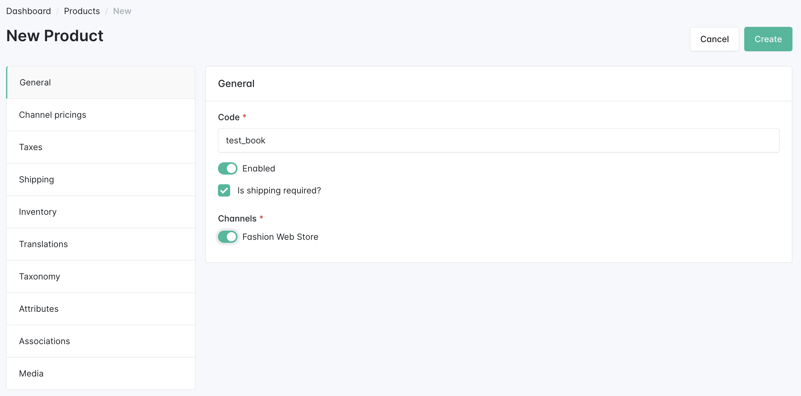
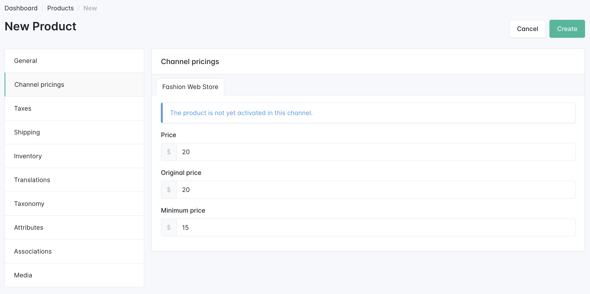
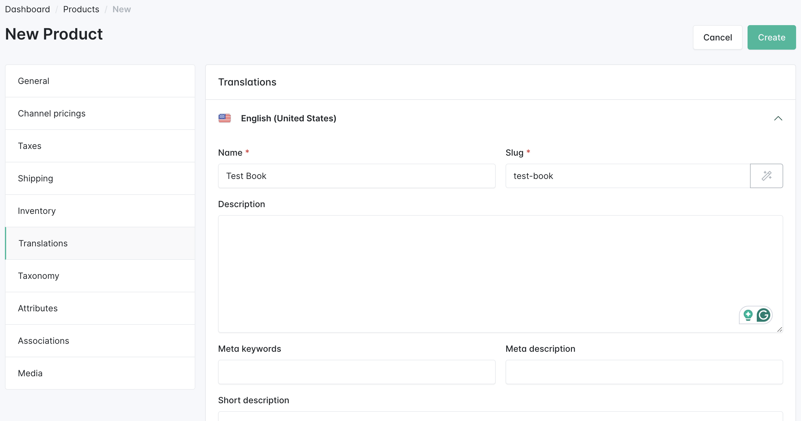

---
layout:
  title:
    visible: true
  description:
    visible: false
  tableOfContents:
    visible: true
  outline:
    visible: true
  pagination:
    visible: true
---

# First Product

Products Management is one of the most important sections of the Sylius Admin panel. The **Catalog** section in the menu offers a wide range of options, but for now, we’ll focus on **product creation**.

## Simple & Configurable Products

When creating a product, you first need to choose between two types:

* **Simple Product**: A product with just one version (e.g., a standard book).
* **Configurable Product**: A product that offers options for customers to choose from (e.g., size, color, etc.).

Check out the Products chapter in the Sylius Book for more detailed information.

<figure><figcaption></figcaption></figure>

During the product creation process, you can define many important attributes:

* **Price**: How much does the product cost?
* **Shipping**: Is it a physical product that requires shipping?
* **Inventory Tracking**: Should the product be tracked within the inventory system?
* **Channels**: On which channels will the product be available for purchase?
* **Taxes**: Should any taxes be applied during checkout?

Take some time to explore these options in detail later. For now, let’s focus on filling in the essential data required to create a product.

<figure><figcaption></figcaption></figure>

<figure><figcaption></figcaption></figure>

<figure><figcaption></figcaption></figure>

## Summary

Great, the first stage is done!&#x20;

Now that the basic setup is done, we can move on to more advanced topics, such as **customizing Sylius features** and **deploying your store** to a server to make it available to the world.
