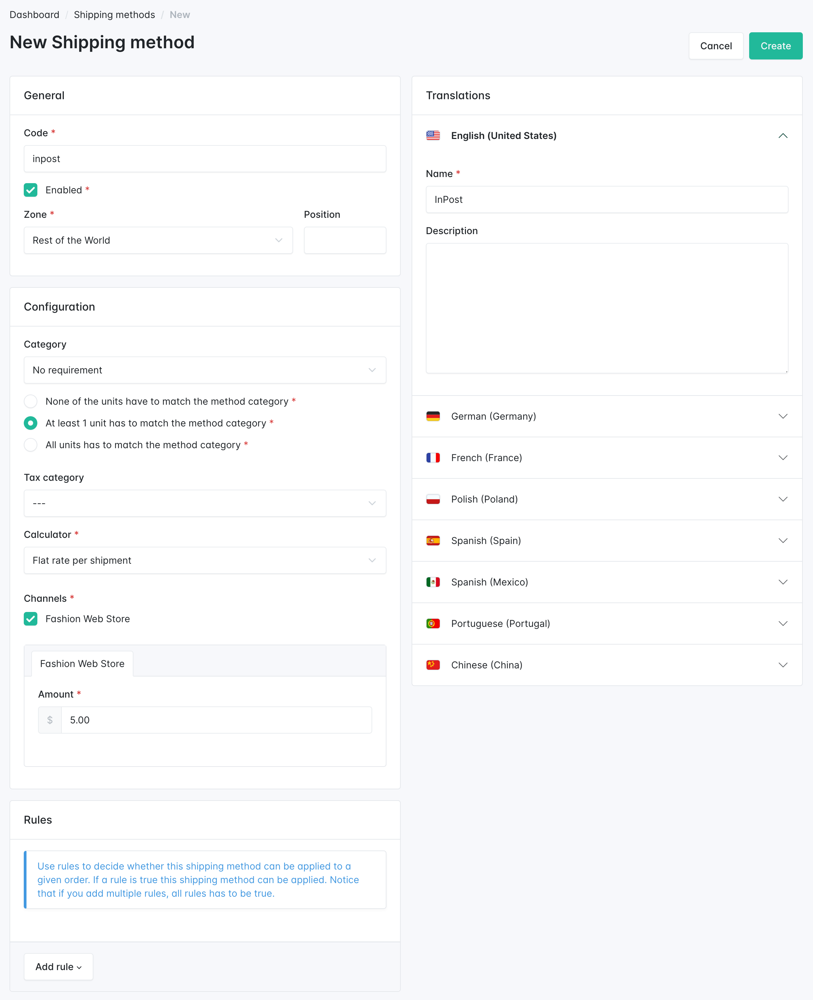
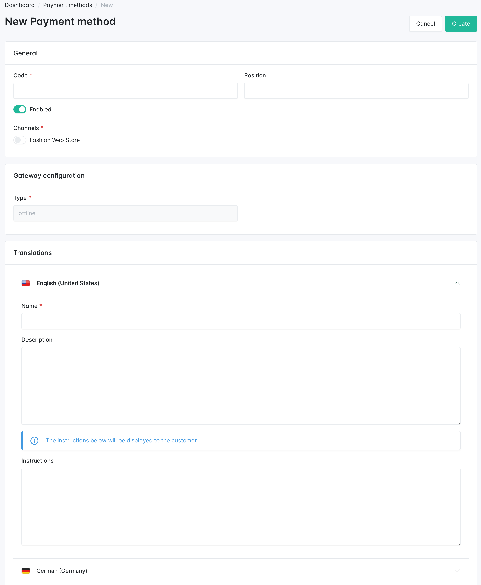

---
layout:
  title:
    visible: true
  description:
    visible: false
  tableOfContents:
    visible: true
  outline:
    visible: true
  pagination:
    visible: true
---

# Shipping & Payment

With the basic configuration completed, we can now move forward and set up the necessary options for customers to buy your products. During the checkout process, customers need to choose how they want their orders to be shipped and paid for.

## Shipping method

Sylius allows you to configure different **shipping methods** based on factors such as the shipping address (which is where the **Zone** concept becomes important) or the product's affiliation with a specific **Shipping Category**.

Let’s create a shipping method named **“InPost”** that charges $5.00 for the entire order.

<figure><figcaption></figcaption></figure>

## Payment method

Customers also need to choose how they wish to pay for their orders. At least one **payment method** is required for checkout.

Before creating a payment method, ensure you have set up a **payment gateway** if necessary. Sylius supports an **Offline** payment method by default, but you can add more payment gateways via plugins.

Here’s how to create a payment method:

1. Go to the **Payment Methods** section.
2. Select the payment method gateway for which you will create the payment method (if applicable) and configure it:

<figure><figcaption></figcaption></figure>


You can find additional payment gateway integrations by exploring [Sylius plugins](https://sylius.com/plugins).


Great! The only thing left is creating some products, and we can go shopping!\
