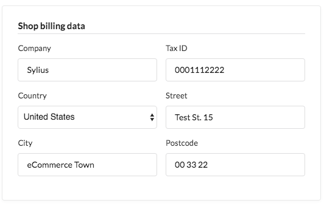

---
layout:
  title:
    visible: true
  description:
    visible: false
  tableOfContents:
    visible: true
  outline:
    visible: true
  pagination:
    visible: true
---

# 🧩 Invoices

An invoice is a commercial document issued by a shop as a confirmation of a sales transaction. It lists the products, quantities, and prices agreed upon, and typically includes payment terms (e.g., due date, payment status). For the shop, it's a sales invoice; for the customer, it's a purchase invoice.

<figure><figcaption></figcaption></figure>

## Invoicing in Sylius

Sylius provides invoicing functionality through [a free open-source plugin](https://github.com/Sylius/InvoicingPlugin). For installation, refer to the plugin’s README.

Once the plugin is installed, a new “Invoices” item appears under the “Sales” section in the admin panel. This lets you view all issued invoices with sorting and filtering options. An “Invoices” section is also added to the admin Order page and the customer's Order page in the shop.

<figure><figcaption></figcaption></figure>

### When is an Invoice Issued?

By default, invoices are generated when the customer places an order (after clicking the Confirm button at checkout). The invoice becomes downloadable for both the admin and the customer at this point.


To change when invoices are generated, customize the logic in the event listener and `OrderPlacedProducer`. Check [here](https://github.com/Sylius/InvoicingPlugin/blob/main/src/Resources/config/services/listeners.xml#L18-L23).


### Sending and Downloading Invoices

Sending an invoice is separate from its generation. By default, invoices are sent when the order's payment is marked as paid.

To change this, you can modify the configuration in the `config.yml` file by adding or editing state machine event listeners.

### Shop Billing Data

The plugin uses the billing data provided in Sylius Channels for invoice details. Each channel has a section where you can input shop billing data, which will be shown on the invoice.

<figure><figcaption></figcaption></figure>

<figure><figcaption></figcaption></figure>

## Learn more

* [Sylius Invoicing Plugin](https://github.com/Sylius/InvoicingPlugin)

<figure><figcaption></figcaption></figure>

