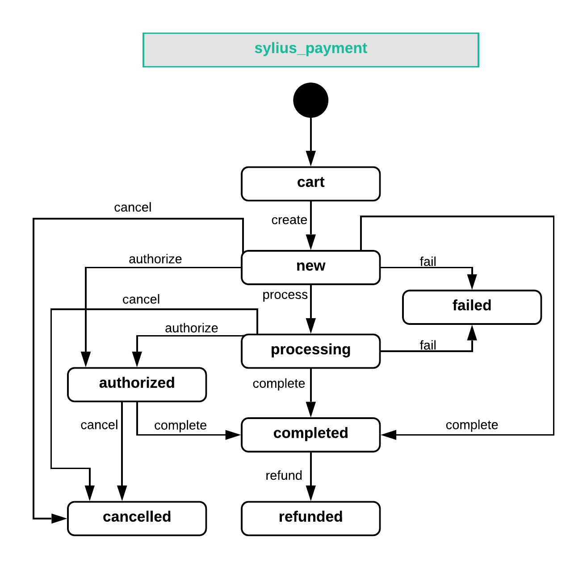

---
layout:
  title:
    visible: true
  description:
    visible: false
  tableOfContents:
    visible: true
  outline:
    visible: true
  pagination:
    visible: true
---

# Payments

Sylius has a flexible payment management system that integrates with various gateways through the Payum library. Payum handles operations like capturing, refunds, and recurring payments, while Sylius manages payments within the checkout and tracks related payment data.

## Payment

Every payment, whether successful or failed, is represented by the `Payment` model in Sylius. This model includes essential details and links to the related order.

### Creating a Payment Programmatically

Payments must be linked to an order. To create a new payment:

```php
$payment = $this->container->get('sylius.factory.payment')->createNew();
$payment->setOrder($order);
$payment->setCurrencyCode('USD');
$this->container->get('sylius.repository.payment')->add($payment);
```

### Payment State Machine

Payments in Sylius have a state machine with states such as: **cart, new, processing, completed, failed, cancelled,** and **refunded.**

The available transitions between these states are:

```
transitions:
    create:
        from: [cart]
        to: new
    process:
        from: [new]
        to: processing
    authorize:
        from: [new, processing]
        to: authorized
    complete:
        from: [new, processing, authorized]
        to: completed
    fail:
        from: [new, processing]
        to: failed
    cancel:
        from: [new, processing, authorized]
        to: cancelled
    refund:
        from: [completed]
        to: refunded
```

<figure><figcaption></figcaption></figure>

You can add custom states and transitions to fit your workflow. Transitions trigger changes to the payment state.

## Payment Methods

`PaymentMethod` defines how customers pay during checkout and is linked to a payment gateway with custom configurations.

### **Creating a Payment Method Programmatically:**

```php
$paymentMethod = $this->container->get('sylius.factory.payment_method')->createWithGateway('offline');
$paymentMethod->setCode('ALFA1');
$this->container->get('sylius.repository.payment_method')->add($paymentMethod);
```

Ensure you add the payment method to a channel to make it available:

```php
$paymentMethod->addChannel($channel);
```

### Payment Gateway Configuration

To add a custom gateway, create a configuration form type and tag it with `sylius.gateway_configuration_type`. Check out examples like PayPal and Stripe for guidance. If you're unsure, refer to the Payum documentation.

#### Troubleshooting

Sylius saves payment data in the `details` column of `sylius_payment`, which can be helpful for debugging.

#### **PayPal Error Code 10409**

If you receive the error "Checkout token was issued for a merchant account other than yours," You have most likely changed the PayPal credentials during the checkout process, clear the cache:

```bash
bin/console cache:clear
```

#### Payment Complete Events

Events such as `sylius.payment.pre_complete` and `sylius.payment.post_complete` are dispatched during certain admin actions. Note that these events don’t cover payments completed by gateways. For that, consider adding a callback to the `sylius_order_payment` state machine for the `pay` transition.
