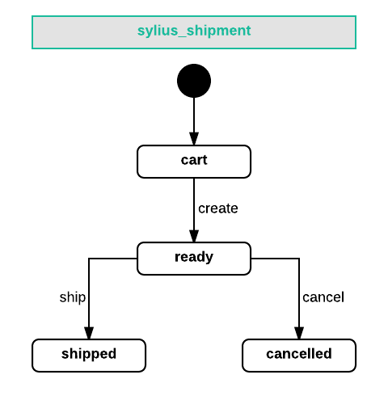

---
layout:
  title:
    visible: true
  description:
    visible: false
  tableOfContents:
    visible: true
  outline:
    visible: true
  pagination:
    visible: true
---

# Shipments

A shipment represents a shipping request for an order in Sylius. Each order can have multiple shipments, and each shipment is made up of `ShipmentUnits`, which correspond to `OrderItemUnits` from the order.

## Creating a Shipment for an Order


To understand the process of creating shipments, refer to the guide on [Orders](orders.md) where shipments are covered in detail.


### Splitting Shipments

In Sylius Plus, orders can be fulfilled partially, allowing for shipment splitting. This feature provides a UI where you can select items from an existing shipment to create a new one and send it (with or without a tracking code). Shipments can be split as long as at least one shipment remains in the `ready` state.

### Shipment State Machine

Each shipment has its own state machine with these states: `cart`, `ready`, `cancelled`, `shipped`.

**Available Transitions:**

```
transitions:
     create:
         from: [cart]
         to: ready
     ship:
         from: [ready]
         to: shipped
     cancel:
         from: [ready]
         to: cancelled
```

<figure><figcaption></figcaption></figure>

## Shipping Methods

A `ShippingMethod` in Sylius represents how an order is shipped to a customer.

**Creating a ShippingMethod Programmatically:**

```php
$shippingMethod = $this->container->get('sylius.factory.shipping_method')->createNew();
$shippingMethod->setCode('DHL');
$shippingMethod->setCalculator(DefaultCalculators::FLAT_RATE);
$shippingMethod->setConfiguration(['channel_code' => ['amount' => 50]]);

$zone = $this->container->get('sylius.repository.zone')->findOneByCode('US');
$shippingMethod->setZone($zone);

$this->container->get('sylius.repository.shipping_method')->add($shippingMethod);
```

To make a shipping method available during checkout, add it to a channel:

```php
$channel = $this->container->get('sylius.repository.channel')->findOneByCode('channel_code');
$channel->addShippingMethod($shippingMethod);
```

### Shipping Method Rules

Rules define when a shipping method is available. Each rule type has a `RuleChecker` that checks conditions like:

* All products in a certain taxon
* Order total greater than a specific amount
* Total weight below a certain number
* Total volume below a certain value

**Rule Types:**

* **Items total greater than or equal**
* **Items total less than or equal**
* **Total weight greater than or equal**
* **Total weight less than or equal**

## Shipping Zones

Shipping zones specify where shipping methods apply. For example, you can configure methods for specific countries. Ensure that each `ShippingMethod` is assigned to the correct zone, as the available methods are based on the customer’s address.

## Shipping Cost Calculators

Shipping cost calculators determine the cost of a shipment. The `CalculatorInterface` has a `calculate()` method that takes a configuration object and returns the shipping cost. The `DelegatingCalculator` selects the appropriate calculator type based on the `ShippingMethod`.

Example:

```php
$shippingCalculator = $this->container->get('sylius.shipping_calculator');
$cost = $shippingCalculator->calculate($shipment);
```

### Built-in Calculators

Sylius includes these built-in calculators:

* **FlatRateCalculator**: Returns a fixed amount from the `ShippingMethod` configuration.
* **PerUnitRateCalculator**: Multiplies the configuration amount by the number of units.

## Shipment Complete Events

These events are triggered when a shipment is marked as shipped:

* `sylius.shipment.pre_ship`
* `sylius.shipment.post_ship`
