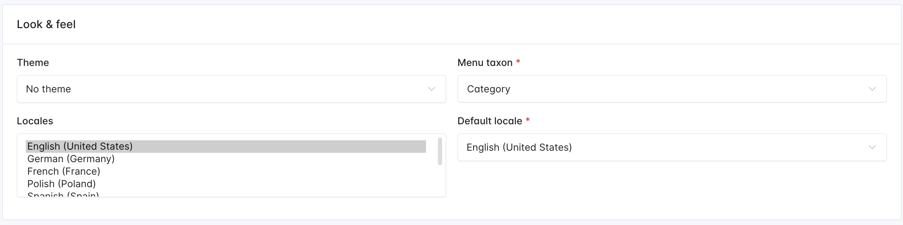
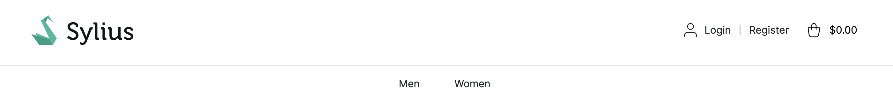
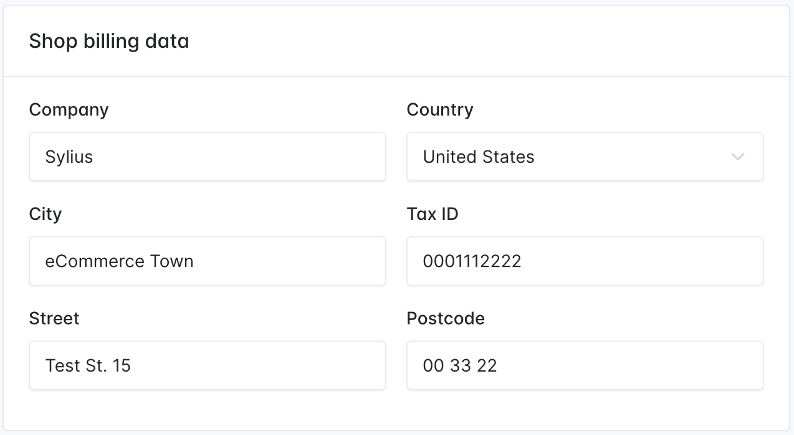
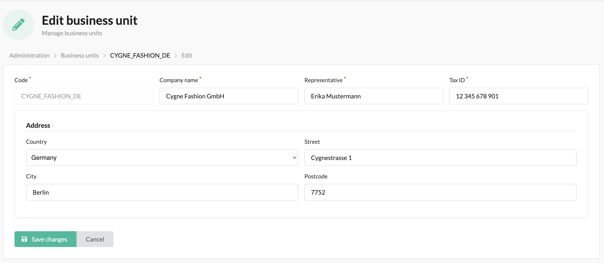
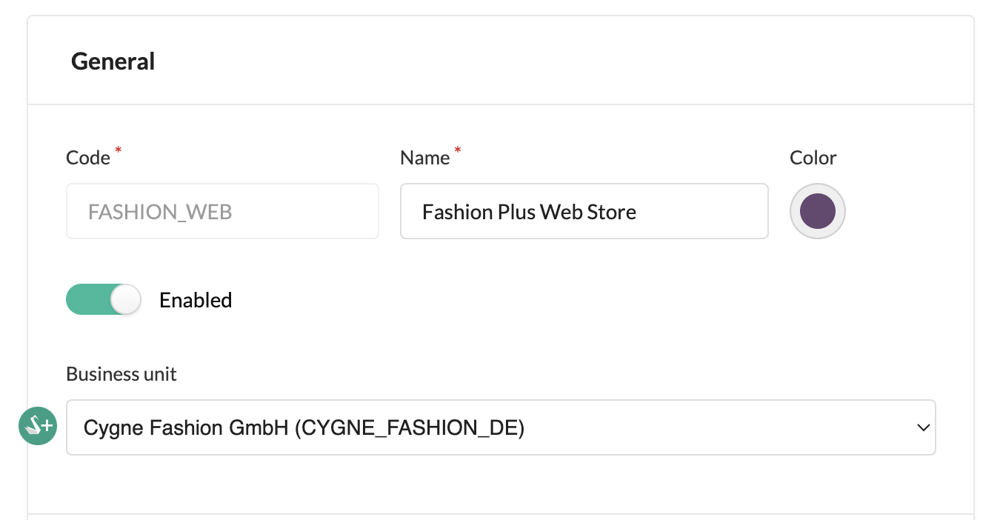

---
layout:
  title:
    visible: true
  description:
    visible: false
  tableOfContents:
    visible: true
  outline:
    visible: true
  pagination:
    visible: true
---

# Channels

In the modern world of e-commerce, your website is no longer the only point of sale for your goods.

The **Channel** model represents a single sales channel, which can be one of the following things:

* Webstore
* Mobile application
* Cashier in your physical store

Or pretty much any other channel type you can imagine.

**What may differ between channels?** Particularly anything from your shop configuration:

* products,
* currencies,
* locales (language),
* countries,
* themes,
* hostnames,
* taxes,
* payment and shipping methods,
* menu.

A **Channel** has a `code`, a `name` and a `color`.

To make the system more convenient for the administrator, there is just one, shared admin panel. Users are also shared among the channels.


In the dev environment, you can easily check what channel you are currently on in the Symfony debug toolbar.\
\



### Different menu root

By default, Sylius will render the same menu for all channels defined in the store, which will be all the children of the taxon with the code _category_. You can customize this behavior by specifying a menu taxon in the “Look & feel” section of the desired channel.

<figure><figcaption></figcaption></figure>

With this configuration, this particular channel will expose a menu starting from the children of the chosen taxon (T-Shirt taxon in this example):

<figure><figcaption></figcaption></figure>

The rest of the channels will still render only children of _category_ taxon.

**How to get the current channel?**

You can get the current channel from the channel context.

```php
$channel = $this->container->get('sylius.context.channel')->getChannel();
```


Beware! When using multiple channels, remember to configure `hostname` for **each** of them. If missing, the default context will not be able to provide an appropriate channel, resulting in an error.



The channel is by default determined based on the hostname, but you can customize that behavior. To do that you have to implement the `Sylius\Component\Channel\Context\ChannelContextInterface` and register it as a service under the `sylius.context.channel` tag. You should also add a `priority="64"` since the default ChannelContext has a `priority="0"` (and by default a `priority="0"` is assigned).



Moreover, if the channel depends mainly on the request you can implement the `Sylius\Component\Channel\Context\RequestBased\RequestResolverInterface` with its `findChannel(Request $request)` method and register it under the `sylius.context.channel.request_based.resolver` tag.


### Shop Billing Data

For [Invoicing](https://docs.sylius.com/en/1.13/book/orders/invoices.html) and [Credit Memo](https://docs.sylius.com/en/1.13/book/orders/refunds.html) purposes Channels are supplied with a section named Shop Billing Data, which is editable on the Channel create/update form.

<figure><figcaption></figcaption></figure>



#### Business Units

Sylius Plus is supplied with an enhanced version of Shop Billing Data from Sylius CE. It is also used for Invoicing and Refunds purposes. Still, it is a separate entity, that you can create outside of the Channel and then pick a previously created Business Unit on the Channel form.

<figure><figcaption></figcaption></figure>

<div>

<figure><figcaption></figcaption></figure>

 

<figure><figcaption></figcaption></figure>

</div>

<div data-full-width="true">

<figure><figcaption></figcaption></figure>

</div>
