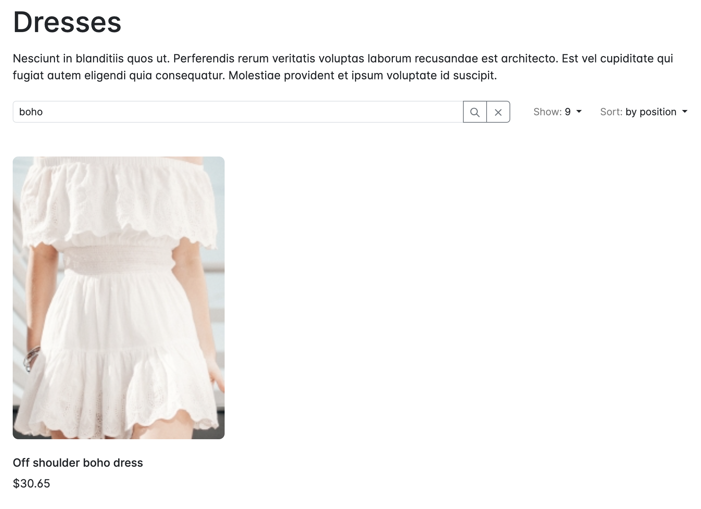

---
layout:
  title:
    visible: true
  description:
    visible: false
  tableOfContents:
    visible: true
  outline:
    visible: true
  pagination:
    visible: true
---

# Search

Product search is a common feature in eCommerce systems, and Sylius offers a simple solution through its **grid filter** functionality. For more advanced use cases, you can extend this functionality or integrate it with **ElasticSearch**.

## Grid Filters

For basic product search needs, Sylius provides search filters within its **grids**. For example, you can search for products by name in a product category using the grid filter.

Here’s an example configuration for the product grid search:

```yaml
# Sylius/Bundle/ShopBundle/Resources/config/grids/product.yml
filters:
    search:
        type: string
        label: false
        options:
            fields: [translation.name]
        form_options:
            type: contains
```

This configuration allows users to search by product names that contain the string entered in the search bar.

Here’s an example of what the search bar looks like:

<figure><figcaption></figcaption></figure>

## Customizing the Search Filter

In many shops, a more sophisticated search might be needed. You may want to add filters for **price**, **reviews**, **sizes**, or **colors**.

If you want to extend the built-in search functionality, you can refer to:

* [The Grids Customization Guide](../../the-customization-guide/customizing-grids.md)
* The [GridBundle](https://github.com/Sylius/SyliusGridBundle/tree/1.13/docs) Documentation

These resources will guide you on how to modify and extend Sylius grid filters to suit your specific needs.

## ElasticSearch Integration

If the grid filtering functionality does not meet your requirements, and you need a more advanced search solution, you can integrate **ElasticSearch** into your Sylius project.

For this, you can use the **BitBagCommerce/SyliusElasticsearchPlugin**. This plugin extends Sylius functionalities with ElasticSearch, allowing for faster and more complex searches.

### **Steps to Integrate ElasticSearch:**

1.  Install the plugin via Composer:

    ```bash
    composer require bitbag/sylius-elasticsearch-plugin
    ```
2. Set up the ElasticSearch server.
3. Configure ElasticSearch in your Sylius application.

For detailed instructions, refer to the plugin's [README documentation on GitHub](https://github.com/BitBagCommerce/SyliusElasticsearchPlugin).
